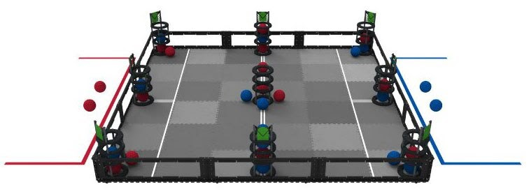

# Change Up Project: Team 1

Team Members: <br/>
- Brandon Lee 
- Amy Hao
- Matthew Ho
- Alex Rudolph
- Max Shen
- Kelly Lin
- William Huang

## Goal

Our goal for this project was to develop problem solving skills in a team environment. Furthermore, in this project we employed the software development lifecycle and gained hands-on experience with the agile design process.

## How to run

Player vs Player game:
```bash 
make game
game.exe
```

Player vs Computer game:
```bash 
make aigame
aigame.exe
```

## The game



Players take turns adding and removing balls to the gameboard. The gameboard consists of a 3x3 grid of goalposts where balls can be added through the top of the post or removed from the bottom. The first player to get four 3-in-a-rows along any column, row, or diagonal wins. 

## How to play

When prompted you can `add` or `remove` a ball from the board by specifying the post number. A mini board will be displayed with the post numbers.

Add a ball to the board:

```bash
add #
```

Remove a ball from the board:

```bash
remove #
```

Each player can make 3 moves per turn with a maximum of 1 remove per turn. The player going first only gets 2 moves on their first turn.

## How it works

**main():**
 Uses Game object of class Game (declare)

Runs and displays the game


**Game class:**
 Uses class GameBoard and class Player (declare and initialize)

Determine a set of rules for the game (score limit, max # of balls, moves/removes per turn).

Member functions usage:
-	Checks status of game (scores, turn, # of balls remaining)
-	Display status of game


**GameBoard class:**
 Uses GoalPost class (declare and initialize)

Member function usage:
-	(via GoalPost) Controls the state of the board (add/remove ball)
-	Checks status of the board (full, layer occupied,)


**GoalPost class:**
 Is used by the GameBoard class to add and remove ball from the “board”


**Player class:**

Contains ID to identify individual players

Member functions usage:
-	control # of balls available
-	get ID value
-	control and get individual score


## Reinforcement Learning

Members involved:
* Matthew Ho
* Alex Rudolph

We implemented a dynamic programming algorithm to learn favourability values for different gameboard state combinations. These value/state policies are then used for the computer to choose the most favourable move in our play against computer game option.

Two bots play training matches against each other. Bots choose favourable moves according to their policy, but there is a predetermined probability that a bot chooses to move randomly (explore) and thereby add new gamestates to its policy. At the end of a match, the winner updates the favourability of its moves with backpropagation. 

Train the model:
```{bash}
make train
train.exe
```
We took advantage of UCSB’s CSIL computers to perform the training for our model. Due to time constraints, we didn’t get through all of the 38 billion (upper bound estimate) gameboard state combinations. 
